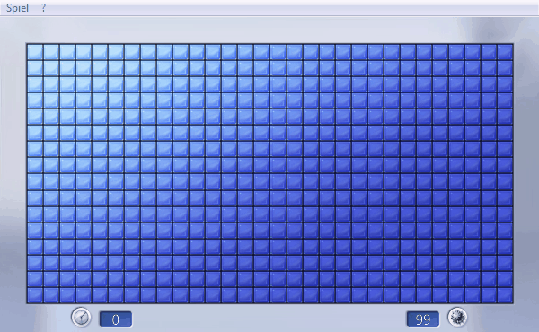
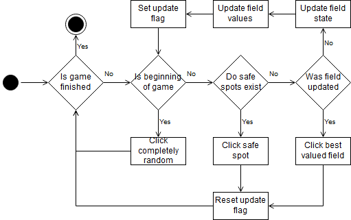

# PySweeper
PySweeper is an application for automatically solving the Windows (7) Minesweeper game using OpenCV template matching for extracting the board state and a Python Win32 wrapper for moving / clicking the mouse.
Creator: P H, ph1387@t-online.de 

---

## Overview
This application can solve the different game field sizes quite reliably. But at some times guessing a safe spot is necessary and can not be avoided due to the nature of the game. After using OpenCV template matching for the first time I would say that directly reading the Process' memory or using another form of image regognition would have been easier and far less error prone since the size of the game must match the templates. Scaling either the image or the templates is an option but causes massive matching errors.
The needed Python-Modules are located in the requirements.txt inside the project.

### Idea
The general idea of the application can be split in four steps:

- Get an image of the game
- Extract the relevant information from the image
- Find the next position(s) to click
- Use the Win32 API to click at the position(s)

The releavant information are the changes after each click since each click on an unchecked square results in a change of the board state.
The main components of the application are the following classes:

|Class|Function|
|-|-|
|Game|Container for all game information|
|Window|Provides the window image as well as the clicking functionality|
|OpenCV|Extracts the image information using template matching|
|DecisionMaker|Decides the positions that are going to be clicked next|
|SquareWrapper|Wrapper for the Square class. Generates the scores used in the DecisionMaker|

### Decision making
The application uses a score system for deciding which square is going to be clicked next. Each one of them gets assigned a value matching their number in the game. If this values exactly matches the number of unchecked squares around a target one, these unchecked squares decrease the value of each square around them. This must be done since these ones are definitely bombs. Once a squares value is decreased to zero, all other neighbours, that are not considered bombs, are recognized as safe and can be clicked one after another.

## License
MIT [license](https://github.com/p1387h/PySweeper/blob/master/LICENSE.txt)